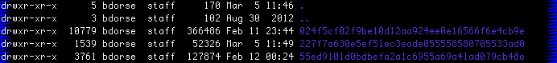

#Downloading iPhone message backups

Script taken from <https://github.com/toffer/iphone-sms-backup>. More info there.

##Downloading messages from a phone you have IRL

1. Plug in phone and back up using iTunes. Make sure that you select back up to __your computer__ and not iCloud.
2. Open terminal and `cd` to the directory that contains `sms-backup.py`.
3. From there, export all of your messages with this command:

`python sms-backup.py -f json -o messages.json`

##Downloading messages from existing iTunes backups

If you want to download messages from existing backups you must first `cd` into your backups directory. Run the following command (on a Mac) replacing `YOURUSER`, with... well... your username.

	cd /Users/YOURUSER/Library/Application\ Support/MobileSync/Backup

From there list your backup files by running `ls -la`. You should see a few cryptic hash files. Each one represents a backup. You will need to remember these filenames as they will be used in the next step.

To transform one of those files into a message export run the `sms-backup.py` script (download [here](#)). Replace `BACKUPHASH` with the cryptic backup filename (not the path) whose messages you want to export and `OUTPUT` with the filename you want to save the export as.

	python sms-backup.py -f json -i BACKUPHASH -o OUTPUT.json

Follow these steps on every backup (or the backups that have the most data. The backup size is shown in bytes in the 4th column of the `ls -la` output) taking care to export each `json` file with a unique name.